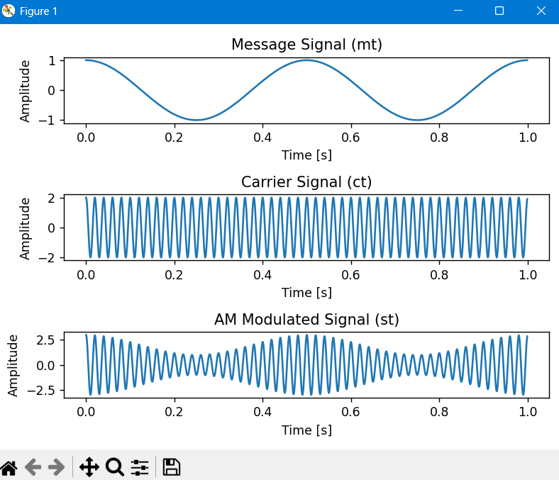
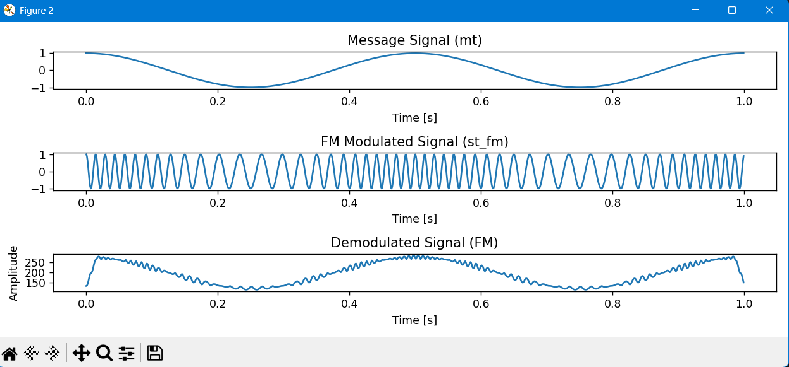

# Analog Modulation and Demodulation Simulation

A Python-based simulation demonstrating the fundamental concepts of **Amplitude Modulation (AM)** and **Frequency Modulation (FM)**, alongside their respective demodulation techniques (Envelope Detection and Differentiation-based Detection). This project illustrates key principles of the physical layer in communication systems and Digital Signal Processing (DSP).

## Project Overview

This repository contains a complete simulation pipeline that models:
1. **AM Modulation & Demodulation:** - Generates a low-frequency message signal and a high-frequency carrier.
   - Applies standard AM modulation.
   - Introduces Gaussian white noise to simulate real-world channel impairments.
   - Demodulates the noisy signal using a diode rectifier abstraction (`np.abs`) followed by a moving average filter acting as a Low-Pass Filter (LPF) envelope detector.

2. **FM Modulation & Demodulation:**
   - Performs frequency modulation based on the message signal's amplitude.
   - Demodulates the FM wave using a differentiator circuit approximation (`np.diff`), converting frequency variations into amplitude variations, followed by envelope detection.

## Core Features & DSP Concept Implementations
- **Signal Generation:** Discrete-time signal implementation using `NumPy`.
- **Noise Injection:** Simulating real-world channel conditions with normal distribution noise (`np.random.normal`).
- **Filtering & Convolution:** Implementing a Low-Pass Filter (RC Time Constant abstraction) via linear convolution (`np.convolve`).
- **Visualization:** Full time-domain plotting using `Matplotlib`.

## Prerequisites & Installation

To run this simulation, you need Python installed along with the following libraries:

